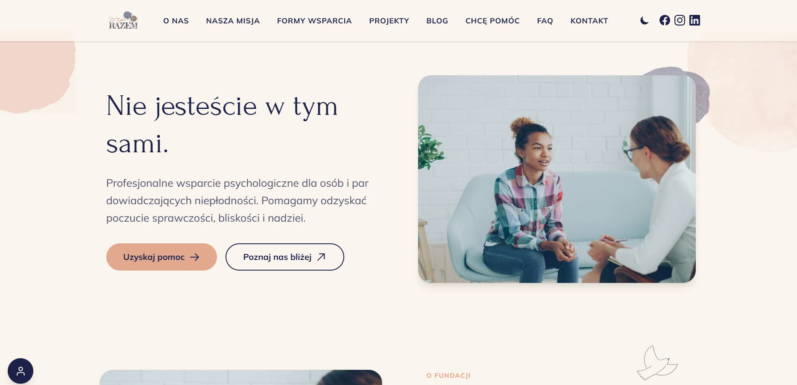
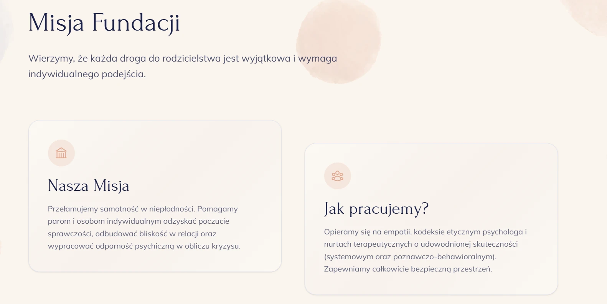
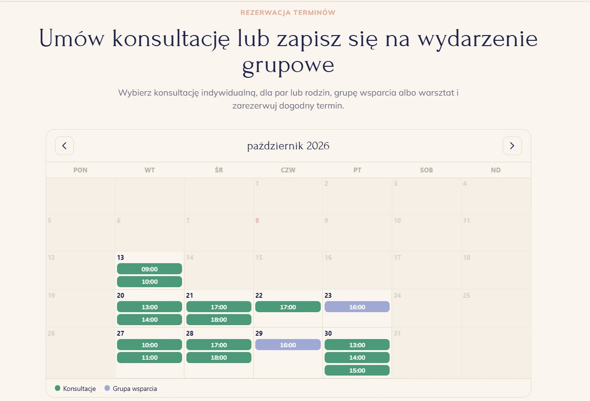
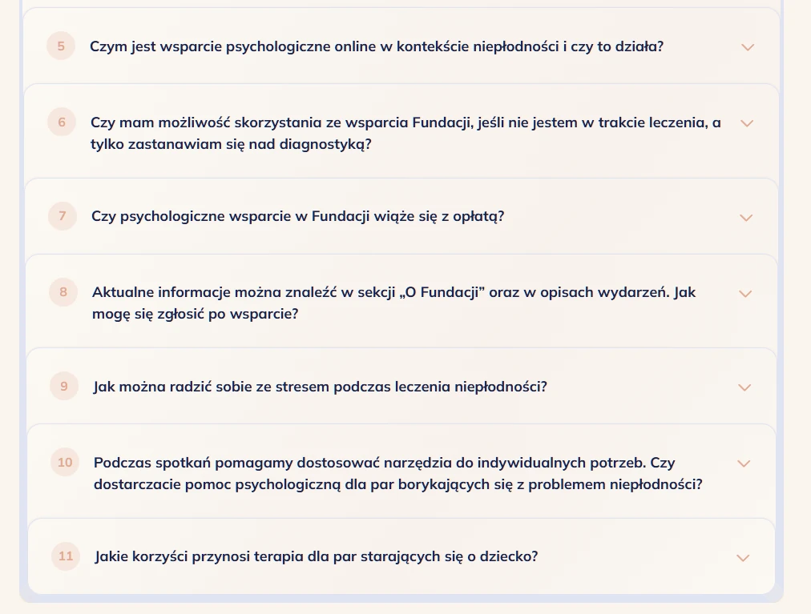
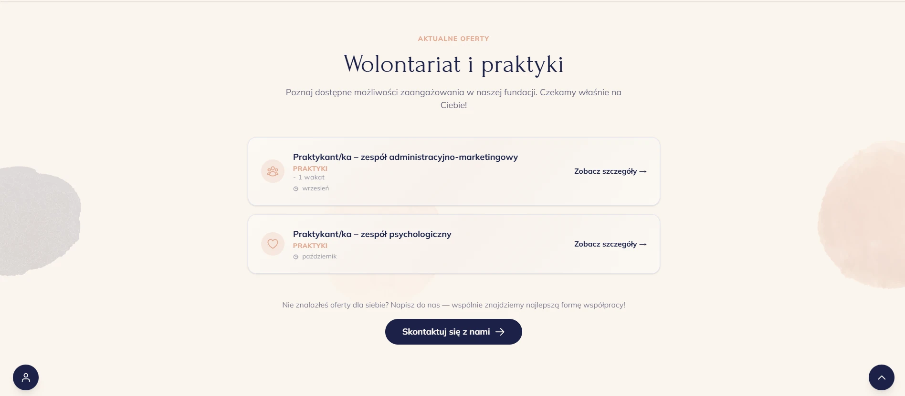
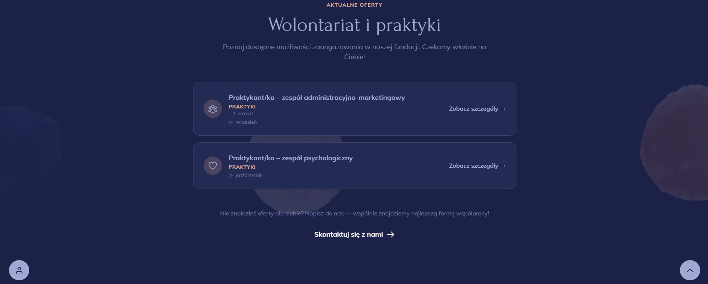
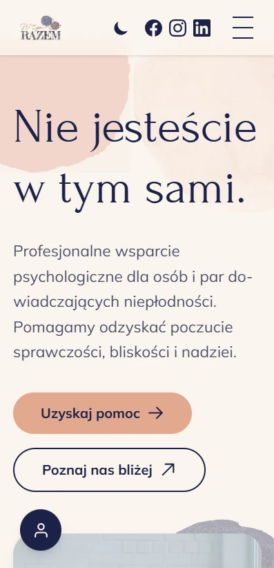
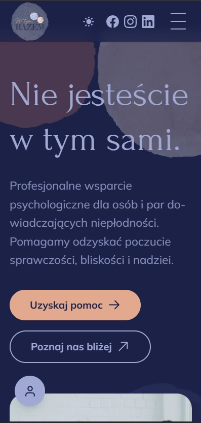
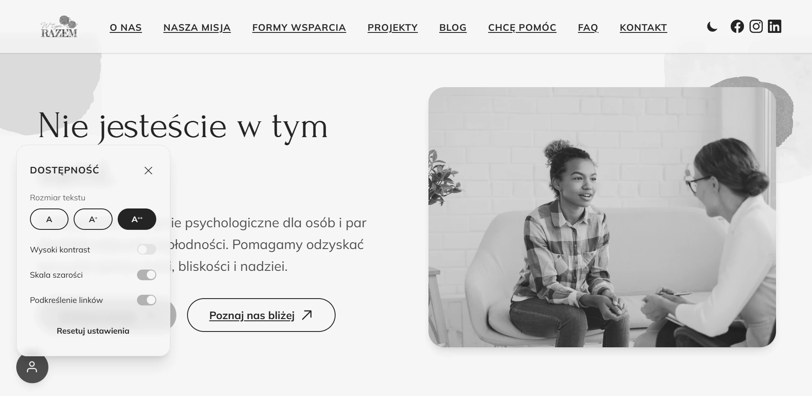

# WtymRazem Foundation website

**The website for an NGO focused on mental health and well-being - designed and delivered end-to-end.**

🔗 Live: [wtymrazem.pl](https://wtymrazem.pl)
🗓 July 2026 - September 2026 · Remote · Solo Web Developer

---

## Context

WtymRazem is a foundation focused on mental health and well-being.

A long time ago, during a hosting migration, the foundation lost its old website - only screenshots of it survived.

Those screenshots were a starting point rather than a template: I drew on them while building a new project, and the result is a different and much better website - one that explains the foundation's mission clearly, lets people book a consultation or apply for a role, and stays easy for a non-technical team to update.

## What I built

- A fully functional, responsive **WordPress** website, with custom UI layouts built using **Tailwind CSS**.
- A multi-page, mobile-responsive structure with a dark/light mode toggle.
- A consultation booking flow with an embedded calendar, plus job application and contact forms.
- Accessibility options: larger font, grayscale mode and underlined links.
- A FAQ page.
- A **MkDocs** knowledge base for the foundation's team and volunteers - covering everything from adding a blog post, through backups and restoring the site, to developing it further.
- New features added over time based on stakeholder feedback.

## Outcome

Live at [wtymrazem.pl](https://wtymrazem.pl), with the team able to manage and extend the site on their own thanks to the knowledge base.

## Stack

`WordPress` · `Tailwind CSS` · `MkDocs` · AI agents

## Screenshots

### Pages

**1. Home page**

**2. Our mission**

**3. Book a consultation** - with an embedded calendar

**4. FAQ** - it's not a bug... it's a feature. The overlap you can see here started as a bug and looked good, so I kept it

### Day and night mode

**5. Day mode**

**6. Night mode**

### Mobile

**7. Mobile - day mode**

**8. Mobile - night mode**

### Accessibility

**9. Accessibility options** - larger font, grayscale mode and underlined links

## How it was built

Built by directing AI agents - prompt, review, test, ship.
