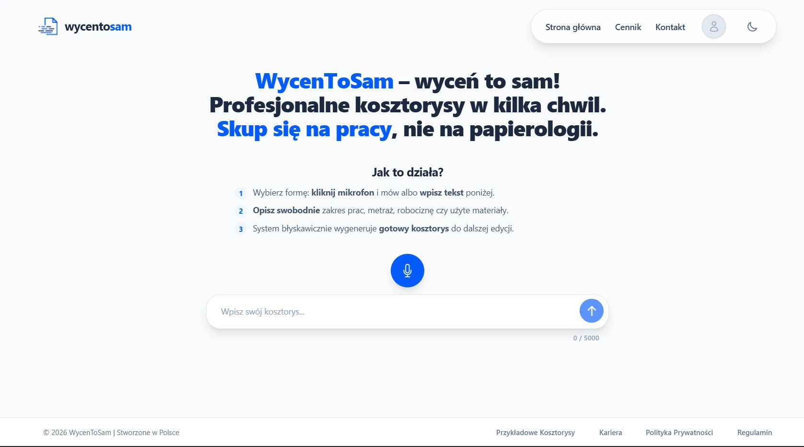
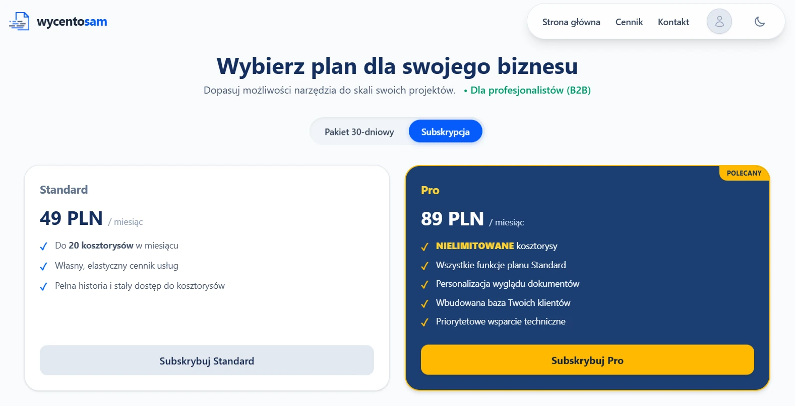
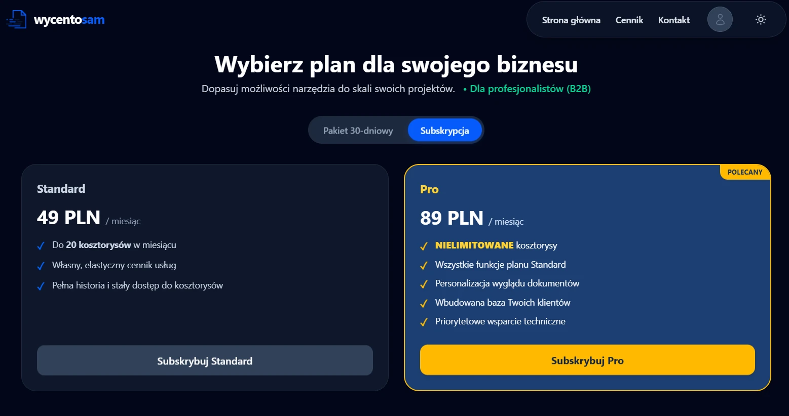
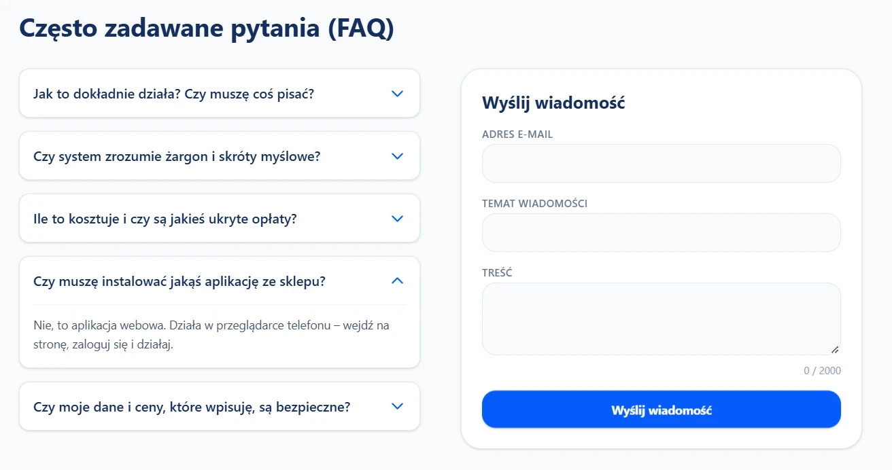
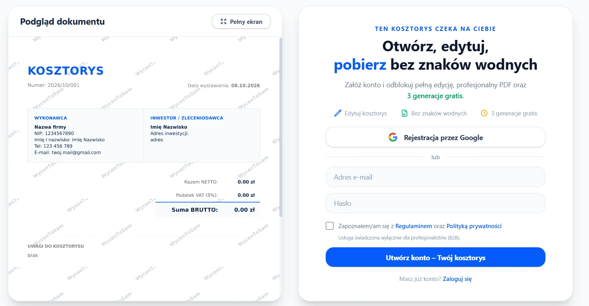
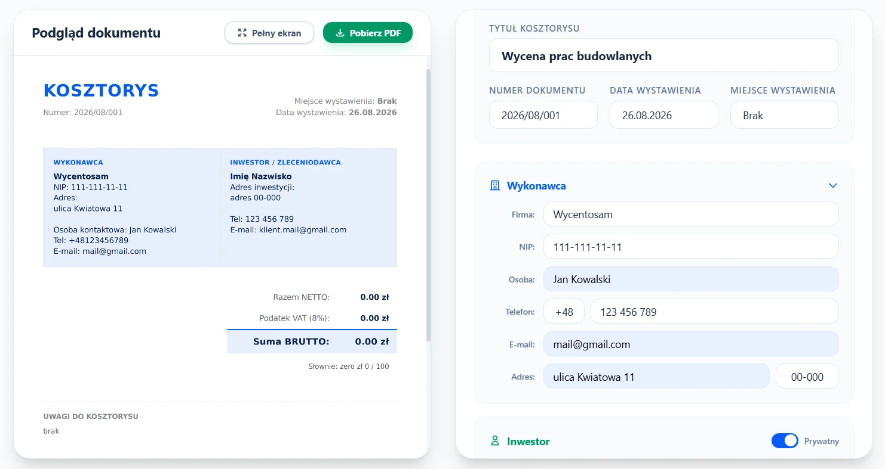
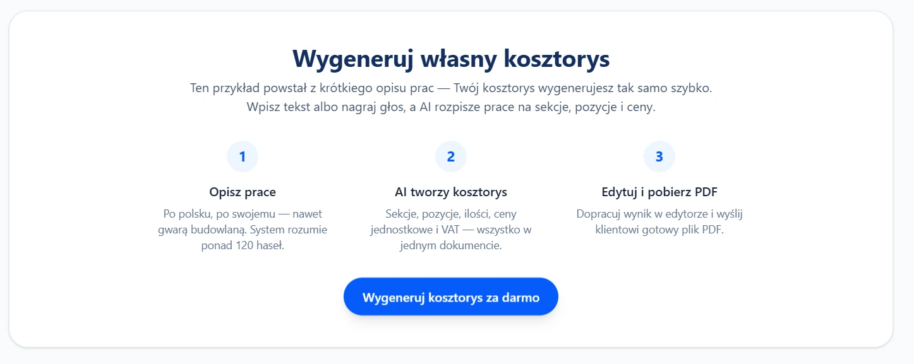

# WycenToSam

**A micro-SaaS that turns voice dictation or text input into structured construction estimates (PDFs).**

🔗 Live: [wycentosam.pl](https://wycentosam.pl)
📄 [Example estimate (PDF)](screenshots/kosztorys-ocieplenie-scian-styropianem.pdf)

---

## Context

Preparing construction estimates is slow paperwork, and it usually starts with someone talking through a list of works. WycenToSam was built around that reality: instead of filling in forms, the user just speaks or pastes the scope and gets a structured estimate as a PDF.

## What I built

- A web application that converts voice dictation or text input into structured construction estimates (PDFs).
- Backend in **Django** and **Python**, integrating the **Deepgram** API for speech-to-text transcription and **OpenAI** to transform natural-language input into a structured JSON schema used for PDF generation.
- Frontend in **Tailwind CSS** and **JavaScript** - a clean, responsive UI that guides the user from voice input to a finished estimate in a single flow.
- A tiered product, with payments and plan handling through **Stripe**.

## Monetisation

Access is tiered, and everything payment-related runs through **Stripe** (checkout and webhooks):

- **Not signed in** - can generate an estimate, but cannot download it.
- **Signed in, no plan** - a limited number of estimates, with the ability to download them.
- **Standard** - a set number of generations plus a selection of features.
- **Pro** - unlimited generations and all features.

Both plans are subscriptions and can be cancelled at any time.

## Outcome

Shipped in 3 weeks from concept to live deployment, and live at [wycentosam.pl](https://wycentosam.pl).

## Stack

`Django` · `Python` · `Tailwind CSS` · `JavaScript` · `Deepgram API` · `OpenAI API` · `Stripe` (checkout + webhooks)

## Screenshots

### Product pages

**1. Home page**

**2. Pricing**

**3. Pricing - dark mode**

**4. FAQ**

### Using the product

**5. Example estimate** - for a user who is not signed in

**6. Editing an estimate**

**7. Generate your own estimate** - with a "what it is / how it works" section at the top

### Mobile

**8. Pro mode on mobile**

**9. Pro mode on mobile - night**

📄 **[See a generated estimate as a PDF](screenshots/kosztorys-ocieplenie-scian-styropianem.pdf)**

## How it was built

Built by directing AI agents - prompt, review, test, ship.
